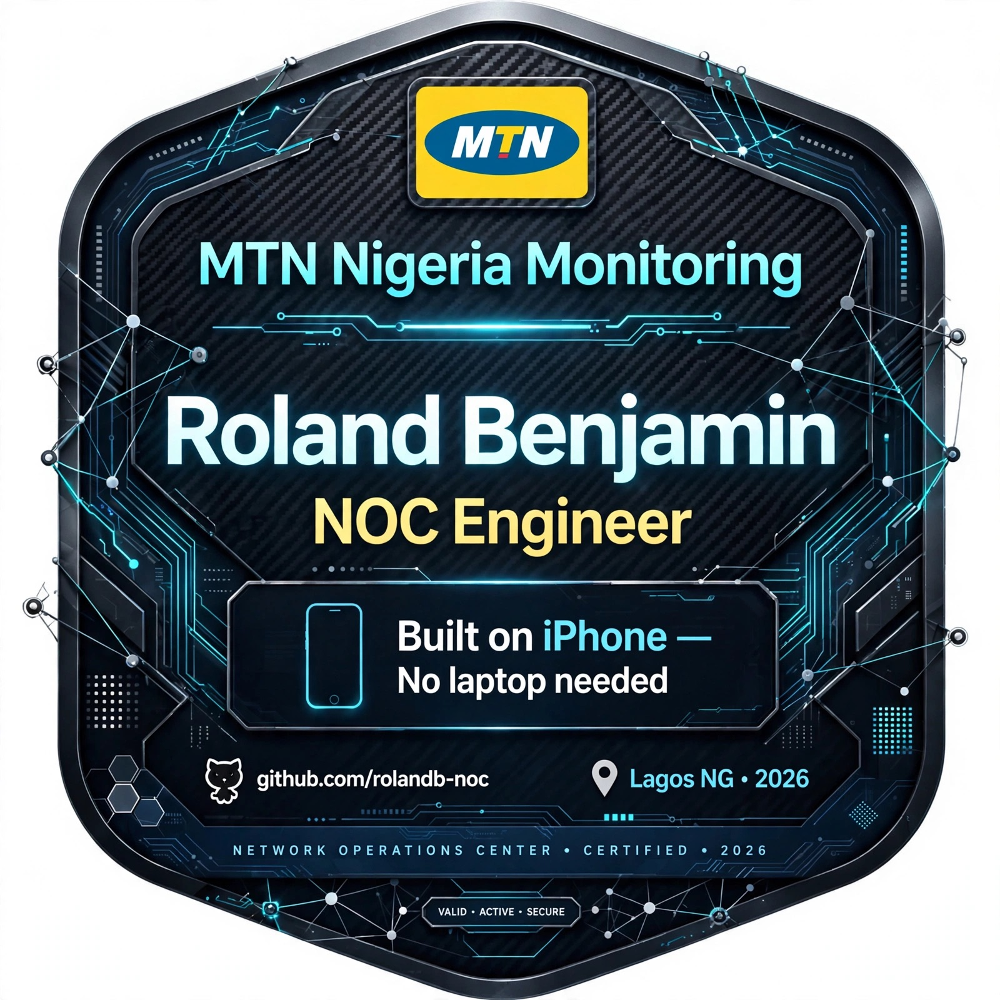

# 🛰️ NOC Toolkit - ISP Monitoring

### Tool 4: IPv6 Prefix Monitor (/64 vs /66)
- Detects if user is on native MTN IPv6 (/64) or tethered hotspot (/66)
- Validates IPv6 routing and latency
- Useful for NOC tickets: Differentiates CGNAT/Hotspot vs Core network fault
### Tool 5: Latency Logger (NOC Trending)
- Logs MTN LTE latency every 60s to mtn-latency.log
- Average: 71.6ms (Lagos, 01-Oct-2026) - 6 samples
- Range: 30ms - 129ms, detected 99ms jitter spike
- Use for shift handover: Shows stability over time

Sample Log:
2026-10-01 12:12:56 - 74.810 ms
2026-10-01 12:13:57 - 129.456 ms
2026-10-01 12:15:07 - 30.080 ms

**Engineer:** Roland Benjamin | **Location:** Lagos, NG
**Repo:** tbenjaminluxe-bot/Noc-toolkit
**ISP:** MTN Nigeria

Live NOC monitoring toolkit built entirely on iPhone (iSH) - tracking ISP performance, latency, and uptime.

## 📊 Current Status
- **ISP:** MTN Nigeria
- **Last Latency:** 60ms (Sep 30 Morning)
- **Status:** ✅ Monitoring Active
- **Platform:** iPhone + iSH + Git + GitHub

## 📁 Files
| File | Description |
|------|-------------|
| NOC-REPORT-Sep*.txt | Daily latency & uptime reports |
| FINAL-ISP-EMAIL.txt | ISP template |

---
*Built on iPhone - No laptop needed*

---
**Engineered by:** Roland Benjamin | NOC Engineer | Lagos, NG
**Platform:** iPhone + iSH + Git + GitHub - No laptop needed 🇳🇬
